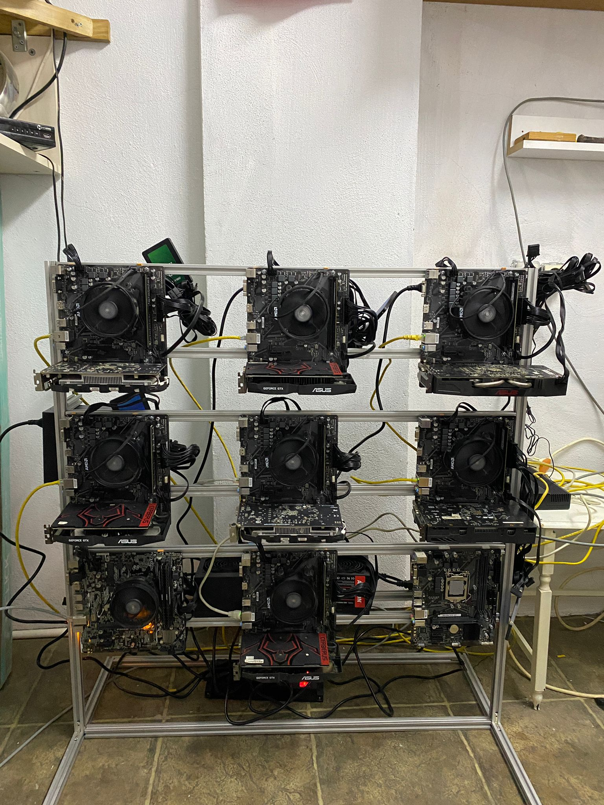

# distributed-computing-rig
#  Distributed Computing Test Rig – 9-Node Bare-Metal Cluster

This project demonstrates the physical setup and network configuration of a distributed computing test rig composed of 9 individual desktop systems. The purpose is to simulate parallel task execution and load distribution across multiple nodes using real hardware.
AI Assistance / Yapay Zeka Desteği
Some parts of the code in this project have been developed with the assistance of OpenAI's ChatGPT AI model.  
For more information, visit: https://chat.openai.com/
Bu projedeki bazı kodlar, OpenAI'nin ChatGPT yapay zeka modeli yardımıyla geliştirilmiştir.  
---

# System Overview

---

# Hardware Specifications

- **Motherboard**: ASUS A520M-K V2 (x9)
- **CPU**: AMD Ryzen 5 3600 (x9)
- **RAM**: 16 GB DDR4 3200MHz (per node)
- **GPU**: NVIDIA GTX 1050 Ti 4GB 128-bit (per node)
- **PSU**: 550W+ Bronze Certified (per node)
- **SSD**: 240GB 2000/1000Mbps (per node)
- **Network**: 16-Port Gigabit Switch (1000 Mbps)

---

# Physical Structure

- Custom open-frame built with **20x20 Sigma Aluminum Profiles**
- Dimensions: **200cm x 100cm x 80cm**
- 80 x Corner Connectors
- 9 x Cat6 cables (2 meters each)
- Designed for airflow, hardware access, and cable management

---

# Networking

- All systems are connected via Cat6 cables to a central gigabit switch
- Static IP addresses are assigned manually  
  Example:
  - `192.168.1.100`  
  - `192.168.1.101`  
  - ... up to `192.168.1.108`

---

# Software Setup

- **Operating System**: Windows 11 on all machines
- **Remote Access**: RDP (Remote Desktop Protocol) is enabled on each node. All systems are fully manageable over the local network or remotely via port forwarding.

---

# Simulation Scenario

This system simulates a distributed computing environment. While not currently running production-grade tasks, the structure is capable of running parallel workloads such as:

>  **SHA-256 Hash Cracking Simulation**  
> A custom Python script could be distributed to each node to brute-force SHA-256 hashes in parallel. Each system processes a different keyspace range, and results are synchronized via shared storage or messaging.  
> This simulates CPU-bound distributed load handling, allowing benchmarking of processing time, coordination latency, and resource efficiency.

---

# Project Goals

- Test feasibility and stability of a bare-metal, multi-node distributed system
- Simulate CPU-bound task distribution (e.g. hashing, rendering, simulations)
- Build a scalable base for future parallel computing research
- Gain practical experience in:
  - Physical rig assembly  
  - Static IP network design  
  - Remote system management  
  - Distributed processing architecture

---

# To-Do / Future Improvements

- Add Linux dual-boot and run real benchmarks (Blender, Folding@Home, etc.)
- Implement shared messaging protocol (e.g. Redis, RabbitMQ)
- Measure CPU/GPU utilization and thermal behavior under load
- Create a Python-based task distribution framework

---

# Contact

**Emre Çetinkaya**  
📧 emrectnkya16@gmail.com  
🔗 [LinkedIn](https://www.linkedin.com/in/emrectnkya16/)
